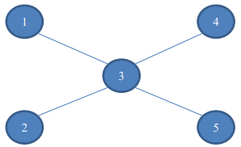
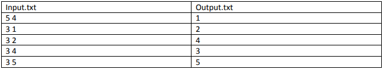

# Метро

В некотором городе есть метро, которое состоит из N (1 <= N <= 1000) станций и M линий,
соединяющих эти станции. Каждая линия соединяет два станции, каждая линия является
двунаправленной. Между двумя станциями может быть только одна соединяющая линия. Схема
метро такая, что абсолютно все станции связаны (в том числе и через промежуточные станции).

По введенной информации о схеме метро необходимо найти допустимый порядок закрытия
станций метро таким образом, что оставшиеся открытые станции всегда были связаны.

Например, возьмем схему метро на изображении:

Станции можно закрывать, например, в следующем порядке 1, 2, 4, 3, 5. А порядок 3, 1, 2, 4, 5 – не
подходит, т.к. после закрытия 3-й станции метро распадется на четыре не связанных между собой
части.

**Входные данные.** Первая строка входного файла содержит целые числа N и M. Следующие M
строк содержат информацию о линиях метро. Каждая из этих строк содержит через пробел
значения Ai и Bi (Ai <> Bi) – две станции, которые соединяет i-я линия.

**Выходные данные.** Выходной файл содержит N строк. Каждая строка представляет собой
название станции. Станции должны идти в порядке их закрытия.

**Пример**

---

## Особенности реализации
* названия станций - строки а не числа
  * строки регистрозависимые
* нет никакого интерактива, названия файлов входящих и исходящих данных жесто заданы прямо в программе
* валидация входящих данных минимальная
* нет обработки исключений
* нет тестов